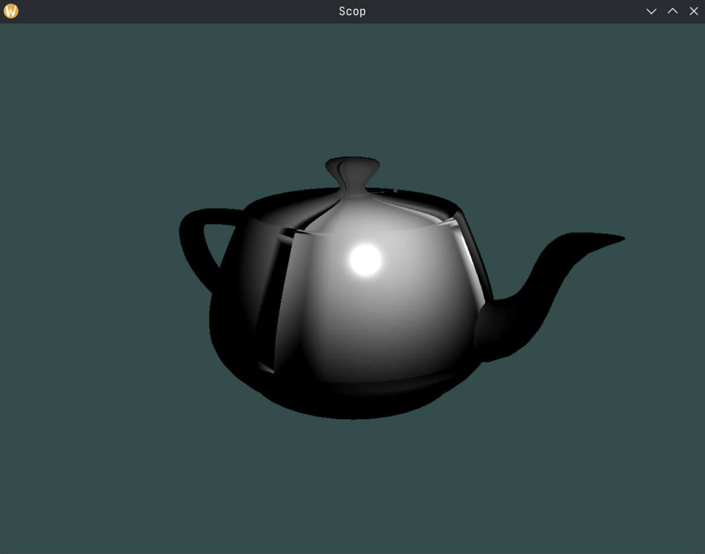

# 🖤 Scop - Your Minimalist OBJ File Renderer

Scop is a lightweight 3D rendering project designed to load and render `.obj` files. It is built using OpenGL and C++ and is intended to provide a simple and efficient way to visualize 3D models.



## Features ✨

- Load and render `.obj` files.
- Support for `.mtl` material files.
- Basic camera controls for navigating the 3D scene.
- Shader-based rendering pipeline.
- Lightweight and easy to use.

## Project Structure 📂

```
scop/
├── .gitignore
├── lsan.supp
├── Makefile
├── scop.d
├── glad/
│   ├── include/
│   │   ├── glad/
│   │   │   └── glad.h
│   │   └── KHR/
│   │       └── khrplatform.h
│   └── src/
│       └── glad.c
├── inc/
│   ├── MathUtils.hpp
│   ├── scop.hpp
│   └── class/
│       ├── Camera.hpp
│       ├── CameraControl.hpp
│       ├── GameObject.hpp
│       ├── Mesh.hpp
│       ├── Shader.hpp
│       ├── Transform.hpp
│       └── Window.hpp
├── obj/
├── resources/
│   ├── 42.obj
│   ├── 42.mtl
│   ├── teapot2.obj
│   └── teapot2.mtl
├── shaders/
│   ├── fragment.glsl
│   └── vertex.glsl
└── src/
    ├── CameraControl.cpp
    ├── GameObject.cpp
    ├── main.cpp
    ├── MathUtils.cpp
    ├── Mesh.cpp
    ├── parse.cpp
    ├── processInput.cpp
    ├── Shader.cpp
    ├── Transform.cpp
    └── Window.cpp
```

## Prerequisites 🛠️

- A C++ compiler that supports C++17 or later.
- OpenGL development libraries.
- Make.

## Installation 🚀

1. Clone the repository:
   ```bash
   git clone https://github.com/your-username/scop.git
   cd scop
   ```

2. Build the project using the provided `Makefile`:
   ```bash
   make
   ```

3. Run the application:
   ```bash
   ./scop [path to .obj file]
   ```

## Usage 🎮

- Place your `.obj` and `.mtl` files in the `resources/` directory or anywhere else.
- Run the application and provide the path to the `.obj` file as a command-line argument:
  ```bash
  ./scop resources/your_model.obj
  ```
- Use the following controls to navigate the 3D scene:
  - `W`, `A`, `S`, `D`:  Move the object in space.
  - `F`: Toggle texture rendering.
  - Hold and drag the scroll mouse button: Rotate the camera.
  - Scroll the mouse button: Zoom in and out.
  - `Esc`: Exit the application.


## File Descriptions 📜

- `src/`: Contains the source code for the project.
- `inc/`: Header files for the project.
- `glad/`: OpenGL loader library.
- `shaders/`: Vertex and fragment shaders for rendering.
- `resources/`: Example `.obj` and `.mtl` files.
- `Makefile`: Build script for compiling the project.

## Contributing 🤝

Contributions are welcome! Feel free to open issues or submit pull requests to improve the project.

## License 📄

This project is licensed under the MIT License. See the LICENSE file for details.

## Acknowledgments 🙌

- [GLM](https://github.com/g-truc/glm) - OpenGL Mathematics library.
- [GLAD](https://github.com/Dav1dde/glad) - OpenGL loader generator.
- [LearnOpenGL](https://learnopengl.com/) - For tutorials and resources on OpenGL.

---

Happy rendering! 🎉
